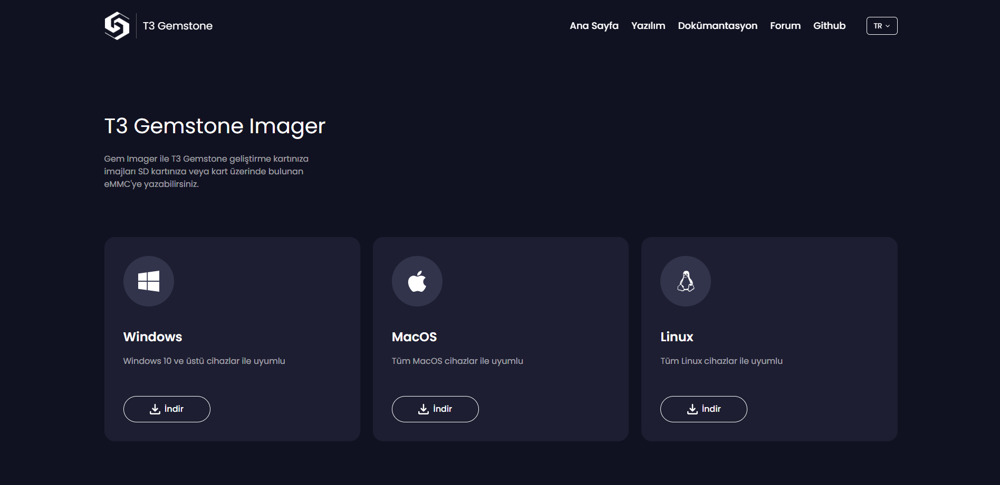
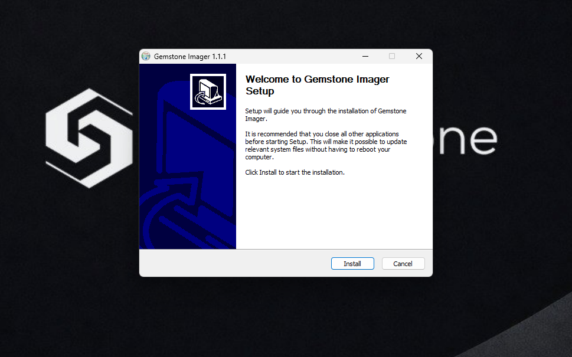
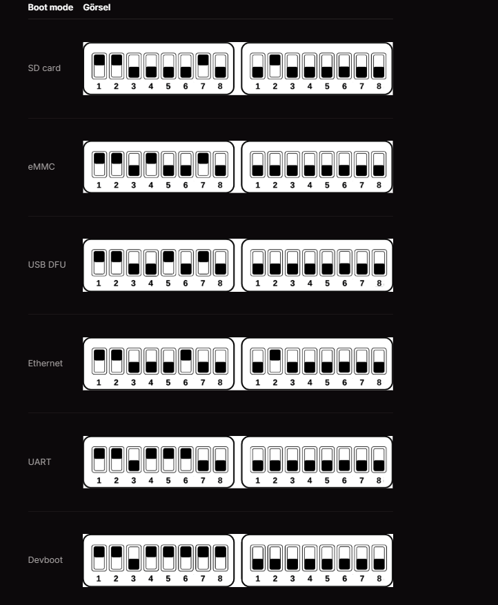
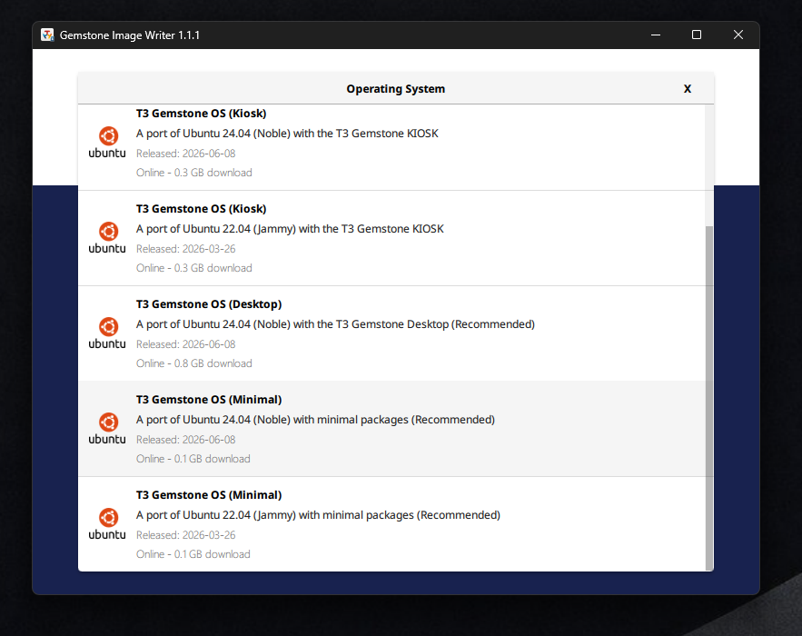
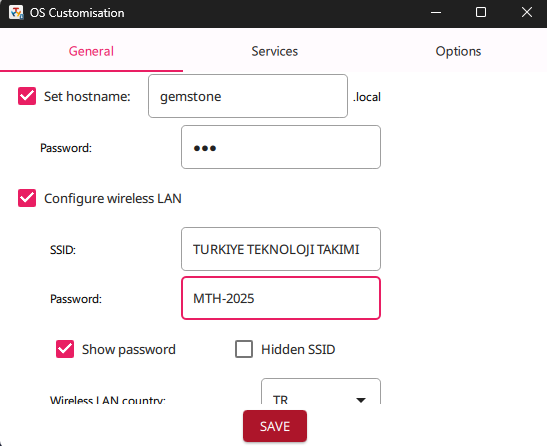
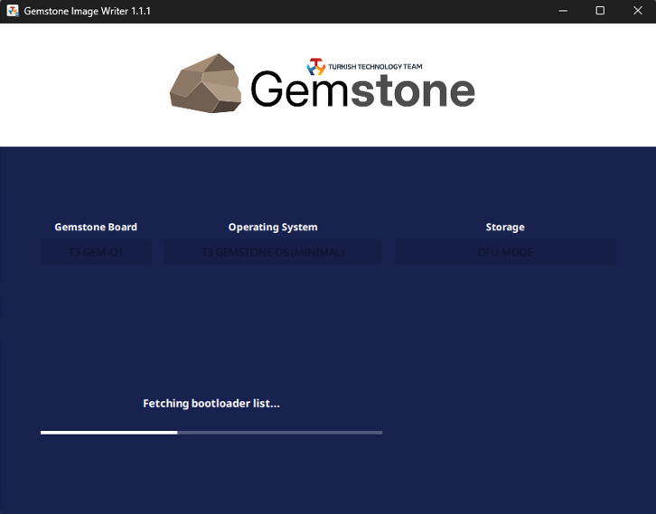

# 2. İmajın Karta Yazılması (Gem Imager)

Gem Imager, T3 Gemstone kartlarına işletim sistemi imajı yazmak için
kullanılan resmi masaüstü uygulamasıdır. Raspberry Pi Imager'a benzer
şekilde çalışır; Qt6 ve C++ ile geliştirilmiştir. Uygulamanın tüm
özellikleri için T3'ün resmi dokümantasyonuna bakabilirsiniz:
[docs.t3gemstone.org/tr/imager/introduction](https://docs.t3gemstone.org/tr/imager/introduction).

## Gem Imager'ın İndirilmesi

Resmi T3 Gemstone dokümantasyon sitesindeki Hızlı Başlangıç
(Quickstart) sayfası üzerinden indirilir:
[t3gemstone.org/software](https://www.t3gemstone.org/software). Bu
sayfada işletim sisteminize (Windows, Linux, macOS) uygun Gem Imager
sürümünün indirme bağlantısı bulunur.

  
   
  <em>Gem Imager indirme sayfası (t3gemstone.org/software)</em>

### Kurulum

1. İndirilen kurulum dosyası (`.exe`) çalıştırılır.
2. Kurulum sihirbazı adımları takip edilerek Gem Imager bilgisayara
   kurulur.
3. Kurulum tamamlandığında Gem Imager açılabilir hale gelir.

  
   
  <em>Gem Imager kurulum sihirbazı</em>

## Kartın DFU Moduna Alınması

T3 Gemstone O1 kartı için farklı işletim sistemi imaj seçenekleri
(Minimal, Desktop, Kiosk vb.) sunulmaktadır. ArduPilot gibi headless
(arayüzsüz) bir uygulama çalıştırmak için **Minimal** imaj yeterli ve
önerilen seçenektir.

Kartın imaj yazılabilmesi için önce DFU (Device Firmware Update)
moduna alınması gerekir. Kart üzerinde iki adet 8'li DIP switch grubu
bulunur; bu switch'ler kartın açılış modunu belirler (SD card, eMMC,
USB DFU, Ethernet, UART, Devboot). DFU moduna geçmek için switch'ler
"USB DFU" konumuna ayarlanmalıdır.

  
   
  <em>Boot mode'lara göre DIP switch konumları</em>

> **Not:** Switch numaraları board revizyonuna göre değişebilir. Kesin
> pin kombinasyonu için kart üzerindeki serigrafiye veya resmi
> dokümantasyona bakılmalıdır:
> [docs.t3gemstone.org/tr/quickstart](https://docs.t3gemstone.org/tr/quickstart).
>
> Bu rehberde imaj microSD karta yazılmaktadır. İmajı kartın dahili
> eMMC'sine yazmak isterseniz T3'ün ilgili dokümantasyon sayfasına
> bakınız:
> [docs.t3gemstone.org/tr/imager/emmc](https://docs.t3gemstone.org/tr/imager/emmc).

## Gem Imager ile İmajın Seçilmesi ve Yazılması

1. Kart DFU modundayken ve bilgisayara USB Type-C ile bağlıyken Gem
   Imager açılır.
2. Gem Imager'ın ana ekranında "Cihaz Seç" (Choose Device) adımında
   DFU modundaki T3 Gemstone O1 kartı otomatik olarak listelenir ve
   seçilir.
3. "İşletim Sistemi" (Operating System) menüsünden **Minimal** imaj
   seçilir.

  
   
  <em>Gem Imager — İşletim sistemi seçimi (Minimal imaj)</em>

> **Not:** İnternet bağlantınızın stabil olduğundan emin olun; imaj
> indirme sırasında bağlantı kesilirse yeniden başlatmanız gerekebilir.

4. Açılan "OS Customisation" (Sistem Özelleştirme) penceresinde kart
   ile ilgili ayarlar yapılır:
   - **General** sekmesinde: hostname (örn. `gemstone`) ve kullanıcı
     şifresi belirlenir.
   - Kablosuz ağ bağlantısı için "Configure wireless LAN"
     işaretlenir; bağlanılacak ağın SSID ve şifresi girilir, Wireless
     LAN country alanından ülke kodu (örn. `TR`) seçilir.
   - **Services** ve **Options** sekmelerinden gerekli görülen diğer
     ayarlar (varsa) yapılır.
   - Ayarlar tamamlandığında **SAVE** butonuna basılarak kaydedilir.

  
   
  <em>Gem Imager — OS Customisation (Sistem Özelleştirme) penceresi</em>

> Sekmelerdeki tüm seçeneklerin ayrıntılı açıklaması için:
> [docs.t3gemstone.org/tr/imager/customization](https://docs.t3gemstone.org/tr/imager/customization).

5. "Yaz" (Write) butonuna basılarak işlem başlatılır. Bu işlem tek bir
   adımdır: Gem Imager önce seçilen imajı internetten indirir, indirme
   tamamlanır tamamlanmaz otomatik olarak karta yazmaya geçer.
6. İndirme ve yazma işlemi tamamlanana kadar kartın USB bağlantısı
   kesilmemelidir.
7. İşlem tamamlandığında Gem Imager başarı mesajı gösterir.

  
   
  <em>Gem Imager — imaj yazma ilerleme ekranı</em>

> **Not:** OS Customisation adımında girilen hostname, kullanıcı
> adı/şifre ve WiFi bilgileri, kart ilk açıldığında otomatik olarak
> uygulanır. Bu sayede kart ilk açılışta doğrudan belirlenen WiFi
> ağına bağlanabilir.
>
> **Dikkat:** İmaj yazma işlemi sırasında kartın USB bağlantısının
> kesilmesi veya bilgisayarın uyku moduna geçmesi imajın bozulmasına
> yol açabilir. İşlem tamamlanana kadar bilgisayarı ve USB bağlantısını
> olduğu gibi bırakın.

---

Devam etmek için [03-ilk-baglanti-ssh-putty.md](03-ilk-baglanti-ssh-putty.md).
