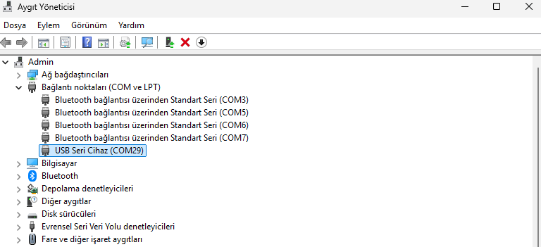
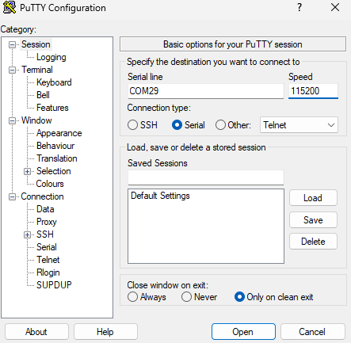
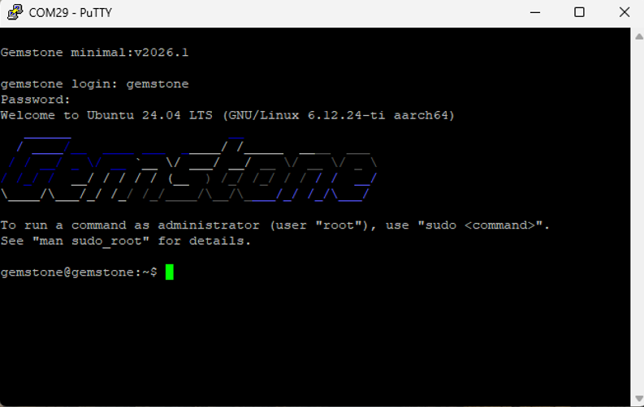

# 3. İlk Açılış ve SSH Bağlantısı (PuTTY)

Kart, seri port (COM portu) üzerinden PuTTY ile bilgisayara
bağlanabilir. Bu bağlantı, kartın işletim sistemine ilk erişim ve
komut satırı (terminal) erişimi sağlamak için kullanılır. Kartın seri
port arayüzleri hakkında daha ayrıntılı teknik bilgi için T3'ün resmi
dokümantasyonuna bakabilirsiniz:
[docs.t3gemstone.org/tr/boards/o1/peripherals/serial](https://docs.t3gemstone.org/tr/boards/o1/peripherals/serial).

## COM Portunun Bulunması

1. Kart, USB Type-C ile bilgisayara bağlanır.
2. Windows Aygıt Yöneticisi (Device Manager) açılır, "Bağlantı
   Noktaları (COM ve LPT)" bölümünde kartın kullandığı COM port
   numarası (örneğin `COM29`) bulunur.

  
   
  <em>Aygıt Yöneticisi — kartın kullandığı COM port numarası</em>

## PuTTY ile Bağlanma

1. PuTTY açılır.
2. Connection type olarak **Serial** seçilir.
3. Serial line alanına bulunan COM port numarası (örn. `COM29`)
   girilir.
4. Speed (baud rate) alanına genellikle `115200` girilir.
5. **Open** butonuna basılarak bağlantı açılır.

  
   
  <em>PuTTY — Serial bağlantı ayarları (COM29, 115200 baud)</em>

6. Kart açılış (boot) sürecini tamamladıktan sonra bir login ekranı
   gelir; Gem Imager üzerinde OS Customisation adımında belirlenen
   hostname ve şifre bilgileri ile giriş yapılır.

  
   
  <em>PuTTY üzerinden bağlantı ve Gemstone login ekranı</em>

---

Devam etmek için [04-wsl-ve-derleme-ortami.md](04-wsl-ve-derleme-ortami.md).
