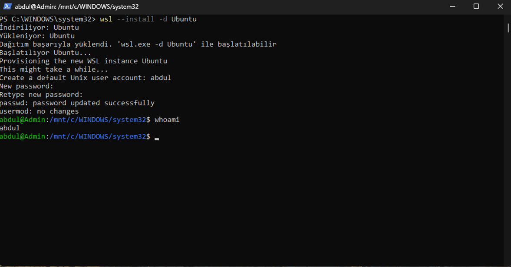
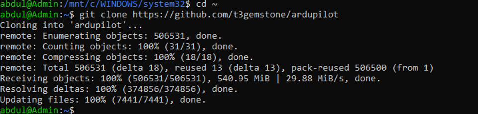
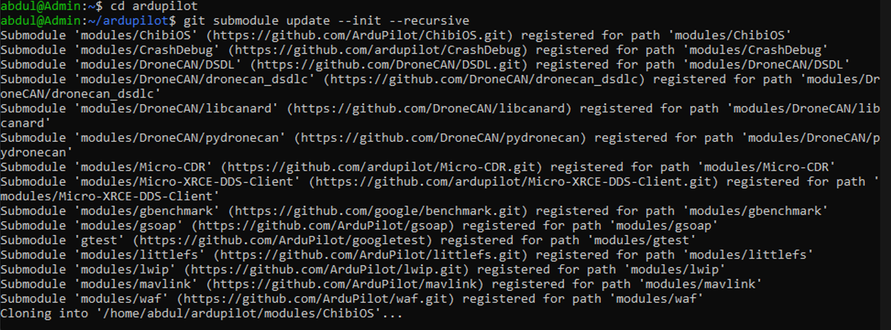
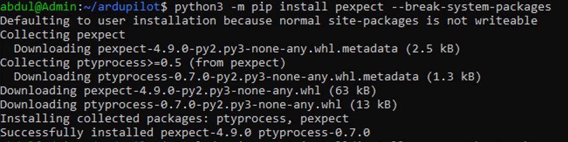
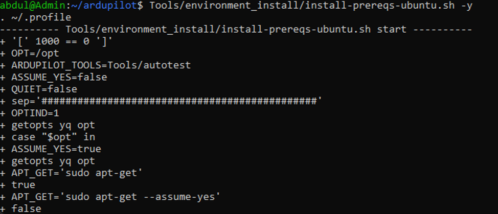
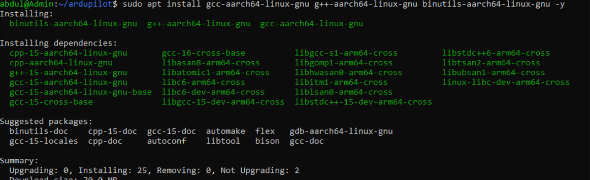
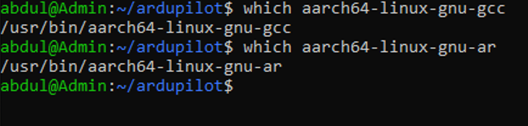
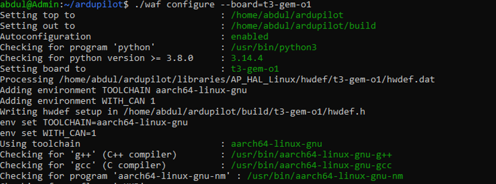
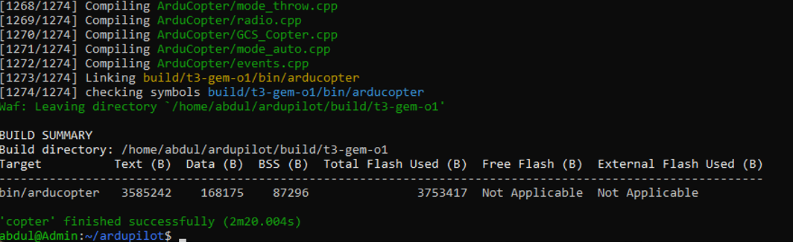

# 4. WSL Kurulumu ve Derleme Ortamı

ArduPilot'un Linux hedefleri için cross-compile (çapraz derleme)
yapılması gerektiğinden, Windows üzerinde bir Linux ortamına (WSL)
ihtiyaç duyulur. Bu bölüm, WSL kurulumundan ArduCopter'ın başarıyla
derlenmesine kadar olan tüm adımları kapsar.

## WSL (Windows Subsystem for Linux) Kurulumu

PowerShell yönetici olarak açılır ve şu komut çalıştırılır. Bu komut,
WSL bileşenini etkinleştirir ve varsayılan Linux dağıtımı olarak
Ubuntu'yu indirip kurar:

```powershell
wsl --install -d Ubuntu
```

<p align="center">
  
  <br>
  <em>PowerShell — WSL üzerine Ubuntu kurulumu</em>
</p>

Kurulum sonrası bilgisayarın yeniden başlatılması istenebilir. Yeniden
başlatma sonrası Ubuntu ilk açılışta bir kullanıcı adı ve şifre
belirlemeyi ister.

### Sistem Güncellemesi ve Gerekli Paketler

WSL içindeki Ubuntu terminalinde aşağıdaki komutlar sırayla
çalıştırılır. İlk satır paket listesini günceller ve mevcut paketleri
yükseltir; ikinci satır ise ArduPilot kaynak kodunu indirmek ve
derlemek için gereken Git ve temel derleme araçlarını
(`build-essential`) kurar:

```bash
sudo apt update && sudo apt upgrade -y
sudo apt install git build-essential -y
```

### Bilinen Kurulum Sorunları

- **Ubuntu terminali açılıp hemen kapanıyorsa:** PowerShell'de
  `wsl --update` komutu çalıştırılıp tekrar denenmelidir.
- **"Read-only file system" / "Input/output error" hataları
  alınıyorsa:** Windows'un `C:` sürücüsünde yeterli boş disk alanı
  olmayabilir. Disk Temizleme aracı ile yer açılıp `wsl --shutdown`
  komutuyla WSL yeniden başlatılmalıdır.

## ArduPilot Kaynak Kodunun Hazırlanması

T3 Gemstone, ArduPilot'un kendi board tanımını (`hwdef.dat`) içeren
bir fork'unu barındırmaktadır:
[github.com/t3gemstone/ardupilot](https://github.com/t3gemstone/ardupilot).

### Klonlama

WSL (Ubuntu) içinde, kullanıcının ev dizininde (Windows dosya sistemi
yerine WSL'in kendi dosya sistemi performans açısından tercih edilir)
aşağıdaki komutlar çalıştırılır. Sırasıyla: ev dizinine geçilir,
ArduPilot'un T3 Gemstone fork'u klonlanır ve oluşan proje klasörüne
girilir:

```bash
cd ~
git clone https://github.com/t3gemstone/ardupilot
cd ardupilot
```

<p align="center">
  
  <br>
  <em>WSL terminalinde ArduPilot deposunun klonlanması</em>
</p>

### Submodule'ların İndirilmesi

ArduPilot deposu, ChibiOS, DroneCAN, mavlink ve waf gibi birçok
bağımlılığı ayrı Git submodule'leri olarak kullanır. Aşağıdaki komut
bu submodule'lerin tamamını indirir:

```bash
git submodule update --init --recursive
```

<p align="center">
  
  <br>
  <em>Submodule indirme işlemi</em>
</p>

Bu adım, ArduPilot'un bağımlı olduğu tüm alt modülleri (ChibiOS,
DroneCAN, mavlink, waf vb.) indirir ve internet hızına bağlı olarak
birkaç dakika sürebilir.

## Cross-Compile Toolchain Kurulumu ve Derleme

Bu bölümdeki komutlar WSL (Ubuntu) terminalinde çalıştırılır; eksik
olan Python paketleri ve derleme araçları buradan kurulur.

### Gerekli Python Paketleri

ArduPilot'un derleme betikleri belirli Python paketlerine ihtiyaç
duyar. Aşağıdaki komutlar pip'i kurar ve ardından `empy` ile
`pexpect` paketlerini sisteme kurar:

```bash
sudo apt install python3-pip -y
python3 -m pip install empy==3.3.4 --break-system-packages
python3 -m pip install pexpect --break-system-packages
```

<p align="center">
  
  <br>
  <em>Python paketlerinin kurulumu</em>
</p>

### ArduPilot Ön Koşul Kurulum Scripti

ArduPilot'un kendi ön koşul kurulum betiği, derleme için gereken tüm
sistem paketlerini otomatik olarak kurar. İkinci satır ise değişen
ortam değişkenlerinin (`PATH` vb.) mevcut oturuma yüklenmesini sağlar:

```bash
Tools/environment_install/install-prereqs-ubuntu.sh -y
. ~/.profile
```

<p align="center">
  
  <br>
  <em>Ön koşul kurulum scriptinin çalıştırılması</em>
</p>

### ARM64 Cross-Compile Toolchain

Kart ARM64 (aarch64) mimarisinde çalıştığından, bilgisayarın x86_64
mimarisinde ARM64 için derleme yapabilmesi için cross-compile
toolchain kurulmalıdır:

```bash
sudo apt install gcc-aarch64-linux-gnu g++-aarch64-linux-gnu binutils-aarch64-linux-gnu -y
```

<p align="center">
  
  <br>
  <em>ARM64 cross-compile toolchain kurulumu</em>
</p>

**Kurulumun doğrulanması:** aşağıdaki komutlar WSL üzerinde
çalıştırıldığında bir dosya yolu döndürüyorsa (örneğin
`/usr/bin/aarch64-linux-gnu-gcc` gibi), toolchain doğru kurulmuş
demektir:

```bash
which aarch64-linux-gnu-gcc
which aarch64-linux-gnu-ar
```

<p align="center">
  
  <br>
  <em>Toolchain kurulumunun doğrulanması</em>
</p>

### Board Configure ve Derleme

Derleme öncesi kart için proje yapılandırılır, ardından ArduCopter
derlenir:

```bash
./waf configure --board=t3-gem-o1
./waf copter
```

<p align="center">
  
  <br>
  <em>./waf copter derleme çıktısı</em>
</p>

Derleme başarılı olduğunda "`'copter' finished successfully`" mesajı
ile birlikte bir derleme özeti (BUILD SUMMARY) görüntülenir. Derlenen
binary şu yolda oluşur: `build/t3-gem-o1/bin/arducopter`.

<p align="center">
  
  <br>
  <em>Derleme özeti (BUILD SUMMARY)</em>
</p>

---

Devam etmek için
[05-karta-aktarim-ve-calistirma.md](05-karta-aktarim-ve-calistirma.md).
