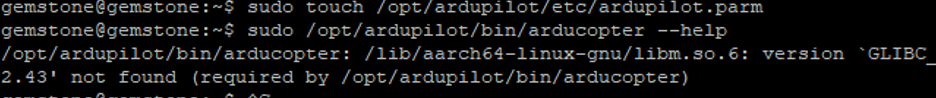
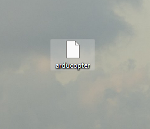
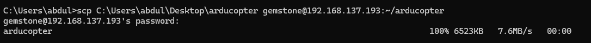
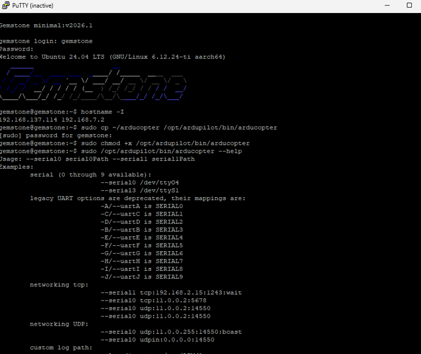

# 5. GLIBC Uyumsuzluğu, Karta Aktarım ve Çalıştırma

Bir önceki bölümde ArduCopter binary'sini başarıyla derledik. Bu
bölümde, derlenen binary'nin kartta neden çalışmayabileceğini, buna
nasıl çözüm bulunacağını ve binary'nin karta aktarılıp çalıştırılma
adımlarını ele alıyoruz.

## GLIBC Uyumsuzluğu ve Statik Link Çözümü

WSL üzerindeki Ubuntu sürümü ile kart üzerindeki Ubuntu sürümünün
GLIBC (GNU C Kütüphanesi) sürümleri farklı olabilir. Bu durumda
derlenen binary kartta çalıştırıldığında aşağıdaki gibi bir hata
alınır:

```
/opt/ardupilot/bin/arducopter: /lib/aarch64-linux-gnu/libm.so.6: version `GLIBC_2.43' not found
```

<p align="center">
  
  <br>
  <em>GLIBC uyumsuzluğu hatası</em>
</p>

### Sürümlerin Kontrolü

Kartta ve WSL'de aşağıdaki komutla GLIBC sürümü görülebilir:

```bash
ldd --version
```

Derleme ortamındaki (WSL) GLIBC sürümü, kartınkinden daha yeni ise,
dinamik olarak derlenen binary kartta çalışmaz.

### Çözüm: Statik Link (`--static`)

ArduPilot'un waf build sistemi, tüm bağımlılıkları (GLIBC dahil)
binary'nin içine gömen statik link seçeneğini desteklemektedir. Bu
sayede binary, hedef sistemin GLIBC sürümünden bağımsız olarak
çalışabilir hale gelir. Aşağıdaki komutlar önceki derleme çıktısını
temizler ve `--static` bayrağıyla yeniden derler:

```bash
./waf distclean
./waf configure --board=t3-gem-o1 --static
./waf copter
```

Statik link ile derlenen binary'nin dosya boyutu, dinamik link ile
derlenen binary'ye göre daha büyük olur; bu beklenen bir durumdur.

> **Not:** Alternatif bir çözüm olarak, WSL üzerinde kartla birebir
> aynı Ubuntu sürümünü kullanan bir Docker container'ı içinde derleme
> yapmak da mümkündür. Ancak statik link yöntemi, ek bir ortam
> kurmadan hızlı bir çözüm sağlamaktadır.

## Binary'nin Karta Aktarılması ve Çalıştırılması

### Kartın Güncel IP Adresinin Bulunması

Kartta PuTTY üzerinden aşağıdaki komut çalıştırılarak kartın ağ
üzerindeki IP adresi öğrenilir:

```bash
hostname -I
```

### WSL'den Karta Doğrudan Aktarım Sınırlaması

> **Dikkat:** WSL2, kendi izole sanal ağında (NAT arkasında)
> çalıştığından, WSL içinden host bilgisayarın yerel ağındaki diğer
> cihazlara (kart gibi) doğrudan erişim genellikle mümkün olmaz. Bu
> nedenle WSL'den doğrudan `scp` ile karta dosya göndermek çoğunlukla
> başarısız olur (bağlantı zaman aşımına uğrar).

### Çözüm: Windows Üzerinden Aktarım

Derlenen binary önce WSL'den Windows dosya sistemine kopyalanır:

```bash
cp ~/ardupilot/build/t3-gem-o1/bin/arducopter /mnt/c/Users/<kullanici>/Desktop/arducopter
```

<p align="center">
  
  <br>
  <em>Binary, Windows dosya sisteminde (arducopter dosyası)</em>
</p>

Ardından Windows PowerShell'den, OpenSSH istemcisi kullanılarak karta
gönderilir:

```powershell
scp C:\Users\<kullanici>\Desktop\arducopter gemstone@<KART_IP>:~/arducopter
```

<p align="center">
  
  <br>
  <em>PowerShell üzerinden scp ile aktarım</em>
</p>

Kartın `gemstone` kullanıcısının şifresi girilerek transfer
tamamlanır.

### Binary'nin Karta Kurulması

Kartta PuTTY üzerinden aşağıdaki komutlar sırayla çalıştırılır. Bu
komutlar binary'yi çalıştırılabilir hale getirir, gerekli klasör
yapısını (log, terrain, storage, parametre dosyası) oluşturur:

```bash
sudo mkdir -p /opt/ardupilot/bin
sudo cp ~/arducopter /opt/ardupilot/bin/arducopter
sudo chmod +x /opt/ardupilot/bin/arducopter
sudo mkdir -p /opt/ardupilot/var/log
sudo mkdir -p /opt/ardupilot/var/terrain
sudo mkdir -p /opt/ardupilot/var/storage
sudo mkdir -p /opt/ardupilot/etc
sudo touch /opt/ardupilot/etc/ardupilot.parm
```

### Çalıştırma Testi

Binary'nin doğru çalıştığını doğrulamak için yardım menüsü çağrılır:

```bash
sudo /opt/ardupilot/bin/arducopter --help
```

Yardım menüsünün hatasız görüntülenmesi, binary'nin karta doğru
şekilde derlenip aktarıldığını doğrular.

<p align="center">
  
  <br>
  <em>arducopter --help çıktısı</em>
</p>

Gerçek bir başlatma denemesi için:

```bash
sudo /opt/ardupilot/bin/arducopter \
  --serial0 udp:127.0.0.1:14550 \
  --log-directory /opt/ardupilot/var/log \
  --terrain-directory /opt/ardupilot/var/terrain \
  --storage-directory /opt/ardupilot/var/storage
```

## Sıradaki Adım: Kalıcı Kurulum

Buradaki adımlar, derlenen binary'nin karta doğru şekilde
aktarıldığını doğrulamak içindir. Kartı her açıldığında ArduCopter'ı
otomatik başlatan bir **systemd servisi** olarak kalıcı şekilde
kurmak, device-tree overlay yapılandırmasını yapmak ve RC girişi/
telemetri (SBUS, QGroundControl) bağlantısını kurmak için T3'ün resmi
ArduPilot dokümantasyonuna bakınız:
[docs.t3gemstone.org/tr/projects/ardupilot](https://docs.t3gemstone.org/tr/projects/ardupilot).

---

Devam etmek için [06-sorun-giderme.md](06-sorun-giderme.md).
